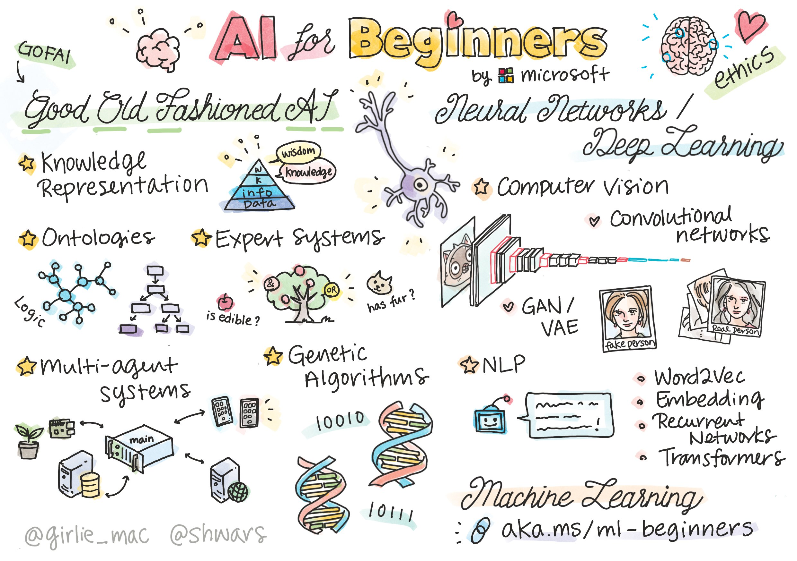

# SI3003 - Artificial Intelligence

Course Repository CM0091 Artificial Intelligence at Universidad EAFIT

> Sketchnote by [Tomomi Imura](https://twitter.com/girlie_mac)

# What you will learn in this course

In this course, students will acquire a **comprehensive and practice-oriented understanding of Artificial Intelligence**, covering classical foundations, modern learning-based approaches, and contemporary generative and agent-based systems.

Specifically, the course covers:

- **Foundations of Artificial Intelligence**, including intelligent agents, problem formulation, uninformed and heuristic search, constraint satisfaction problems, and classical planning.
- **Machine Learning and Deep Learning**, with an emphasis on supervised learning pipelines, decision trees and ensembles, neural networks, and deep learning fundamentals implemented using **PyTorch**.
- **AI for perception and language**, including computer vision with pre-trained convolutional networks, and natural language processing with transformers and zero-shot capabilities.
- **Contemporary AI practice**, including **Generative AI**, scaling laws, large language models, agent-based systems, multimodality, and modern AI engineering practices such as reproducibility, deployment, and responsible AI.
- **Integration and evaluation**, through an end-to-end AI project that consolidates technical, ethical, and engineering considerations.

---

## Evaluation

The evaluation is organized by modules and combines quizzes, theoretical–practical reports, and a final integrative project. The final grade corresponds to the weighted sum of the following components:

| Module / Event | Evaluation | % | Timeline | Dates |
|---------------|------------|---|----------|-------|
| **Module 1 – Foundations, Search & Planning** | Quiz | 5 | Week 4 | August 4 to 9 |
| | Theoretical and practical report | 20 | Week 5 | August 11 to 16 |
| **Module 2 – The Learning Lens** | Quiz | 5 | Week 8 | September 1 to 6 |
| | Theoretical and practical report | 20 | Week 9 | September 8 to 13 |
| **Module 3 – Contemporary Practice** | Quiz | 5 | Week 12 | September 29 to October 4 |
| | Theoretical and practical report | 20 | Week 13 | October 13 to 18 |
| **Module 4 – Evaluation & Integration** | Final project and report (AI Agent) | 25 | Week 16 | November 3 to 8 |

---

### Notes for students

- Reports emphasize **both conceptual understanding and implementation**.
- The final project integrates **Generative AI, agents, and system-level design**.
- The use of **Generative AI tools is permitted**, subject to transparency and academic integrity, as stated in the course policies.

### Lecture 01
- [Lecture01.pdf](Lecture01/Lecture_01.pdf) — Introduction to AI
- Homework:
  - Review the [numpy notebook](Lecture01/notebooks/tools_numpy.ipynb)
  - Review the [pandas notebook](Lecture01/notebooks/tools_pandas.ipynb)
  - Review the [matplotlib notebook](Lecture01/notebooks/tools_matplotlib.ipynb)

### Lecture 02
- [Lecture02.pdf](Lecture02/Lecture_02.pdf) — Search Problems and Uninformed Search

- Notebooks:
  - [Vacuum Agent](Lecture02/notebooks/Vacuum_Agent.ipynb)
  - [Breadth-First Search](Lecture02/notebooks/BreadthFirstSearch_Tutorial.ipynb)
  - [Best-First Search (Uniform-Cost)](Lecture02/notebooks/BestFirstSearch_Tutorial.ipynb)
  - [Iterative Deepening Search](Lecture02/notebooks/Interactive_Depth_Search_Tutorial.ipynb)
  - [Search Methods Comparison](Lecture02/notebooks/Comparativo_BFS_UCS_IDS.ipynb)

- Homework:
  - Research Iterative Deepening Search (IDDFS)

### Lecture 03
- [Lecture03.pdf](Lecture03/Lecture_03.pdf) — Informed Search: A* and Variants

- Notebooks:
  - [Maze Problem](Lecture03/notebooks/0.Maze_problem.ipynb)
  - [Recursive Best-First Search (RBFS)](Lecture03/notebooks/RBFS.ipynb)

- Supporting Material:
  - [Maze Problem Description](Lecture03/PROBLEMA DE MAZE.docx)

- Homework:
  - Compare A* and RBFS in terms of completeness, optimality, time complexity, and memory consumption.
  - Experiment with different heuristic functions for the maze problem and analyze their impact on performance.
 
### Lecture 04
- [Lecture04.pdf](Lecture04/Lecture_04.pdf) — Metaheuristics: Genetic Algorithms and Optimization

- Notebooks:
  - [Genetic Algorithm Planning — Tutorial](Lecture04/notebooks/tutorial_AG_planning.ipynb)
  - [Genetic Algorithm Planning with DEAP](Lecture04/notebooks/tutorial_AG_planning_DEAP.ipynb)
  - [Genetic Algorithm Scheduling](Lecture04/notebooks/tutorial_AG_scheduling.ipynb)
  - [GA Planning Exercise](Lecture04/notebooks/ejercicio_AG_planning.ipynb)

- Supporting Material:
  - [Schedule Construction — First 3 Iterations](Lecture04/build_schedule_first_3_iterations.md)

- Homework:
  - Design and implement a fitness function for the planning or scheduling problem.
  - Analyze how population size, mutation rate, and crossover strategy affect convergence.
  - Discuss the trade-offs between solution quality and computational cost.
 
### Lecture 05
- [Lecture05.pdf](Lecture05/Lecture_05.pdf) — Fundamentals of Machine Learning

- Notebooks:
  - [Data Preprocessing Exercise](Lecture05/notebooks/PreprocessingExercise.ipynb)
  - [Data Preprocessing A](Lecture05/notebooks/Preprocesamiento_de_datos_a.ipynb)
  - [Data Preprocessing B](Lecture05/notebooks/Preprocesamiento_de_datos_b.ipynb)
  - [Linear Regression Exercise](Lecture05/notebooks/linear-regression-exercise1.ipynb)
  - [Logistic Regression Exercise](Lecture05/notebooks/logistic-regression-exercise.ipynb)
  - [Customer Churn Prediction](Lecture05/notebooks/Predicción_de_abandono_de_clientes.ipynb)

- Dataset:
  - [`data/`](Lecture05/data/) — Datasets used for preprocessing and modeling exercises

- Homework:
  - Compare linear and logistic regression in terms of assumptions, use cases, and output interpretation.
  - Build a preprocessing pipeline and justify each transformation applied to the data.
  - Evaluate a simple model using appropriate metrics and discuss potential sources of bias or variance.

# Resources:
* Computational resources: I strongly recommend creating (free) accounts on the following platforms:
  - [Google collaborative](https://colab.research.google.com/)
  - [HuggingFace](https://huggingface.co/)
  - [Kaggle](https://www.kaggle.com/)
  - [LightingAI](https://lightning.ai/)
  - [Weights and Biases](https://wandb.ai/site)
  
* Artificial Intelligence Books:
  - [Artificial Intelligence: A Modern Approach](https://aima.cs.berkeley.edu/)
  - [Artificial Intelligence with Python: A Comprehensive Guide to Building Intelligent Apps for Python Beginners and Developers](https://www.amazon.com/Artificial-Intelligence-Python-Comprehensive-Intelligent/dp/178646439X)

 

 
                                                  

  

